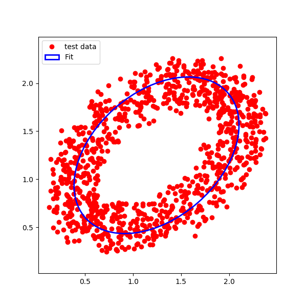

# Least Squares fitting of ellipses, python routine 

Based on the  publication 
[R. Halir and J. Flusser, “Numerically stable direct least squares fitting of ellipses,” 1998.](http://citeseerx.ist.psu.edu/viewdoc/download;jsessionid=42331A070FC446475DCEBA7523B60898?doi=10.1.1.1.7559&rep=rep1&type=pdf)

## Example execution

```python
import ellipses as el
import numpy as np

data = el.make_test_ellipse()

lsqe = el.LSqEllipse()
lsqe.fit(data)
center, width, height, phi = lsqe.parameters()

plt.close('all')
fig = plt.figure(figsize=(6,6))
ax = fig.add_subplot(111)
ax.axis('equal')
ax.plot(data[0], data[1], 'ro', label='test data', zorder=1)

ellipse = Ellipse(xy=center, width=2*width, height=2*height, angle=np.rad2deg(phi),
               edgecolor='b', fc='None', lw=2, label='Fit', zorder = 2)
ax.add_patch(ellipse)

plt.legend()
plt.show()
```


